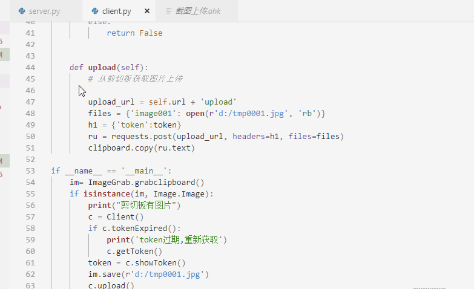

### 用FLASK实现的简单图床  

> 这是我的一个练手项目  
> 起因是七牛改了临时域名的策略，所以打算自己造一个图床  
> server端可以部署到自己的vps上，采用token验证  
> 图片名称自动使用md5加密，返回外链地址
> 通过AutoHotkey调用client  
> 把剪切板里的图片上传到图床 返回图片地址  

* 创建virtualenv环境 python3.6+  

  略..

* 启动服务  

  `python server.py`

* 修改文件路径  

  client.exe需要使用pyinstaller打包  

  `pyinstaller -F client.py`  
  
  根据实际情况修改 `截图上传.ahk` 里面 client.exe的路径, 以及自定义快捷键

* 上传图片

  通过QQ截图  

  通过快捷键 `Alt + ,` 

  调用client上传, 成功后图片地址写在剪切板里，直接粘贴即可

* AutoHotkey 官网  

  [传送门](https://autohotkey.com/)  

* 延伸 

  使用dropbox备份图片  

  nginx反向代理，图片压缩,开启https  

  cloudflare cdn缓存  
